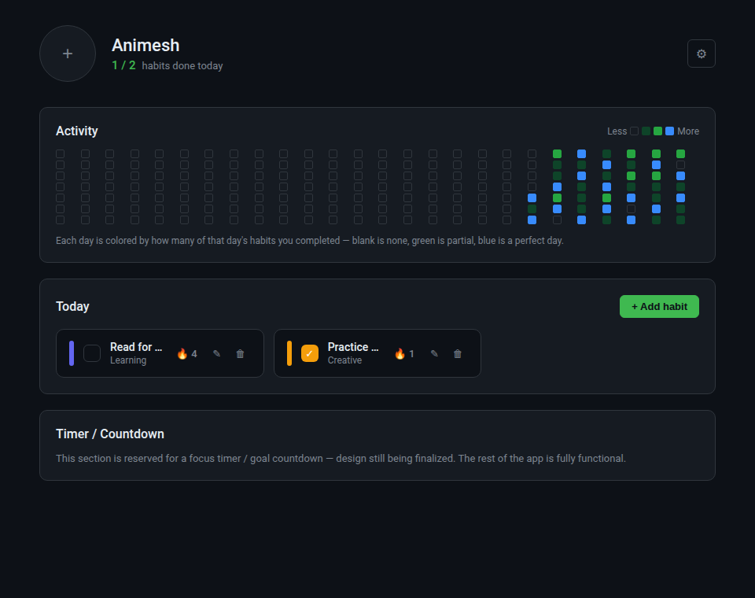
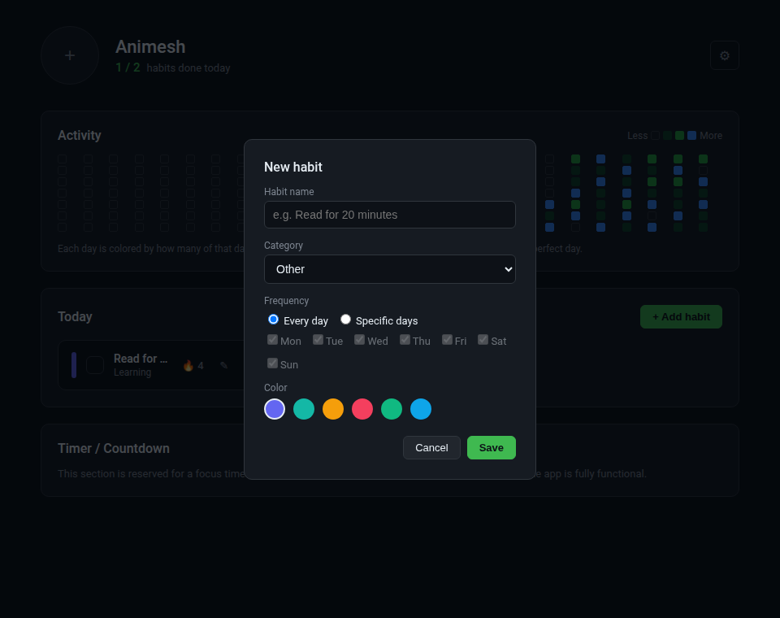
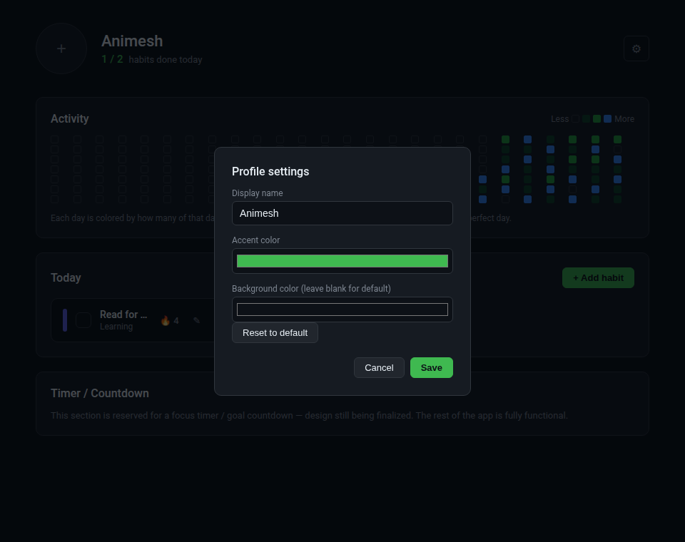

# Daily Habit Tracker

A daily habit tracker you run on your own computer. Track habits, keep streaks alive, and see your consistency on a GitHub-style contributions heatmap — with your own name, photo, and accent color. Python (Flask) on the backend, plain HTML/CSS/JS on the frontend, SQLite for storage. No account, no cloud, no server to pay for — clone it, install it, run it.



## Features

- **Daily checklist** — habits due today, one click to check them off.
- **Streaks** — current and longest streak per habit, computed from real completion history.
- **Flexible scheduling** — a habit can run every day or on specific weekdays only (e.g. gym on Mon/Wed/Fri).
- **Contributions heatmap** — every day is colored by how many of that day's habits you completed: blank (none), light green (some), dark green (most), blue (all of them — a perfect day).
- **Your profile** — upload a photo, set your display name, and pick your own accent and background colors.
- **100% local** — a single SQLite file in the `instance/` folder next to the code. Nothing leaves your machine.

| Add a habit | Profile settings |
|---|---|
|  |  |

## Getting started

You need Python 3.10+ installed.

```bash
git clone https://github.com/<your-username>/daily-habit-tracker.git
cd daily-habit-tracker
python -m venv .venv
source .venv/bin/activate        # Windows: .venv\Scripts\activate
pip install -r requirements.txt
python run.py
```

This starts a local server and opens `http://127.0.0.1:5000` in your browser automatically. Your data lives in `instance/habits.db` — it's created the first time you run the app and is never committed to git.

## Tech stack

- **Python 3 + Flask** — REST API and page serving
- **SQLite** (`sqlite3`, standard library) — local persistence, zero setup
- **Vanilla HTML / CSS / JavaScript** — no build step, no framework, no `node_modules`
- **CSS custom properties** — power the runtime accent/background color customization

## Project structure

```
daily-habit-tracker/
├── run.py                       # entry point - starts the local server
├── requirements.txt
├── app/
│   ├── __init__.py               # Flask app factory
│   ├── routes.py                  # page + REST API routes
│   ├── models.py                   # Habit data model
│   ├── database.py                  # SQLite layer: habits, logs, settings
│   ├── utils.py                      # streak math + heatmap tier logic
│   ├── templates/
│   │   └── index.html                 # the one page
│   └── static/
│       ├── css/style.css               # dark theme, CSS variables for theming
│       ├── js/app.js                    # all frontend logic (fetch-driven, no build step)
│       └── uploads/                      # profile photos land here (gitignored)
└── docs/screenshots/
```

## How the heatmap coloring works

Each day is scored as *(habits completed that day) ÷ (habits due that day)*. Four tiers:

| Tier | Meaning | Ratio |
|---|---|---|
| Blank | Nothing done | 0% |
| Light green | Some done | up to ~60% |
| Dark green | Most done | ~60–99% |
| Blue | Everything done | 100% |

The exact threshold between light and dark green lives in `app/utils.py` (`day_tier`) if you want to tune it.

## How streaks are calculated

A habit's **current streak** counts consecutive *due* days (not calendar days — a Mon/Wed/Fri habit only counts Mon/Wed/Fri) that were completed, walking backwards from today; today itself can still be pending without breaking the streak. **Longest streak** is the best run across the habit's whole history. This logic lives in `app/utils.py`, fully decoupled from the web layer.

## Roadmap

- Focus timer / goal countdown section (scaffolded in the UI, not yet wired up)
- Data export (JSON/CSV)
- Monthly/yearly stats view

## License

MIT — see [LICENSE](LICENSE).
